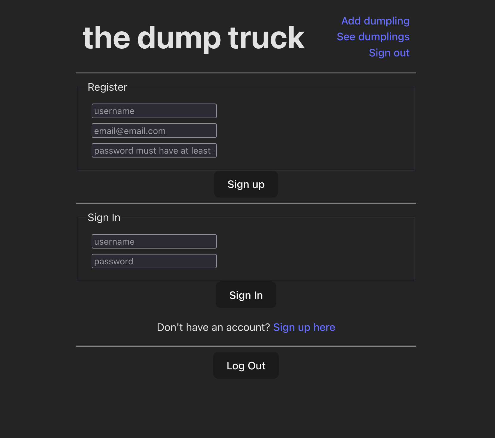
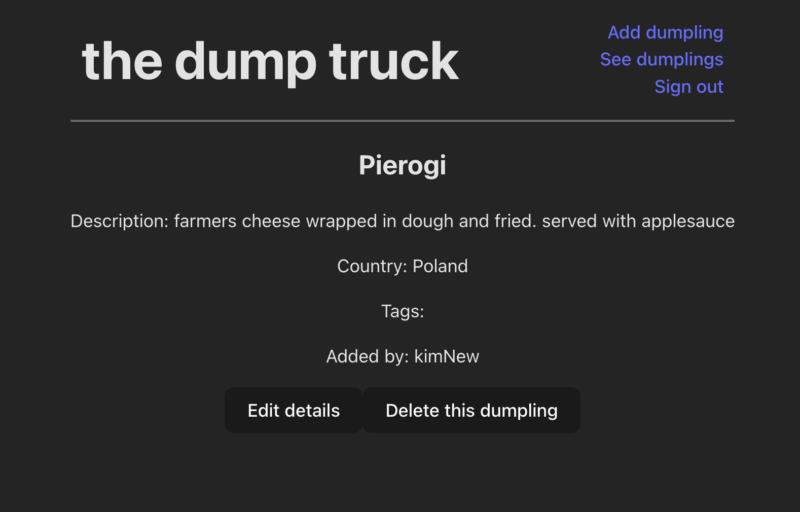

# Dumpling Truck Client
_by Kim Robinson_
[Hosted on Netlify](https://dumpling-atlas.netlify.app/)

#### A React application to act as a client for my [Dumpling API](https://github.com/kimmykokonut/dumpling-api), built with Django

A user can:
- Register, log in, log out
- See the list of dumplings and dumpling details
- Create a new dumpling if signed in with active token

### React Component Diagram

Bugs:
* On dumpling detail component, issue rendering Tag data.  The tagData is correct (and array of strings) but it is not rendering correctly on the Detail page.

Stretch Goals:
User:
  * user can register,login/out. i want it to show in the header who is logged in or offer a signin. (issue as header is outside of state component DumplingControl). 
  (currently read access regardless of signin. user needs to be logged in to create-desired. but need to build out now that it's hosted to test crud for user)
  * Update login page to show sign in only, then they can route to register if needed. once user signed in, only show logout button.
Detail: 
  * add tags property (issue with async/useeffect/state)
Edit:
  * add form, redirect to detail page (log in permission?)
Delete:
  * button. redirect to list/index page (log in permission?)
Style: obvs
Tags/Origin: 
  * Need own Components/Controller to be able to add tags/origin data...
Security thoughts: 
  * currently the token from the signin api call is saved to localstorage. better solution?
