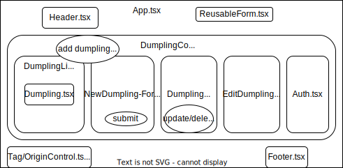

# Dumpling Truck Client
_by Kim Robinson_

#### A React application to act as a client for my [Dumpling API](https://github.com/kimmykokonut/dumpling-api), built with Django

WIP

### React Component Diagram

Done:
render dumpling list
render dumpling detail
render header (add react router for home/list links?)

Todo:
Detail: 
  * add tags property (unsure of how response formatted)
Create:
  * render form (make sure user is logged)
Edit:
  * add form, redirect to detail page (log in permission?)
Delete:
  * button. redirect to list/index page (log in permission?)
User:
  * add registration/login/logoutfunctionality (have conf on page)
Style
Tags/Origin: Need own Components/Controller to be able to add tags/origin data...
Security: currently the token from the signin api call is saved to localstorage. better solution?
